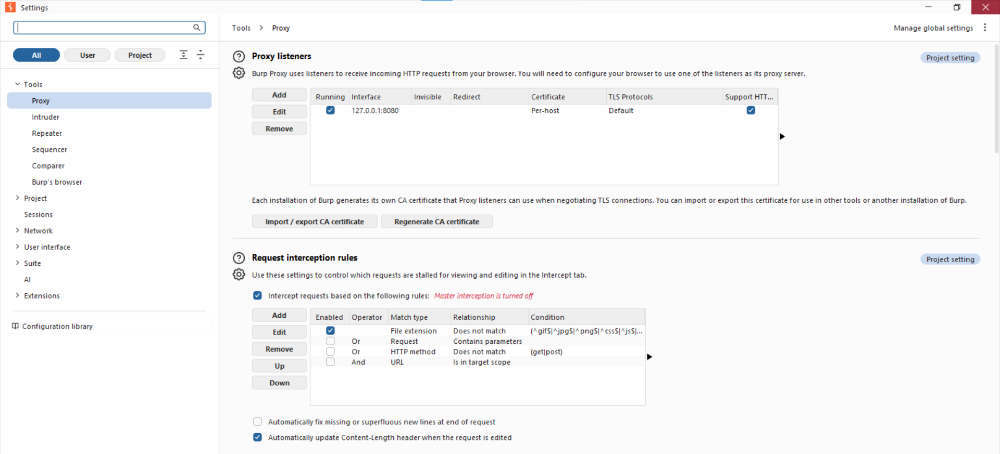
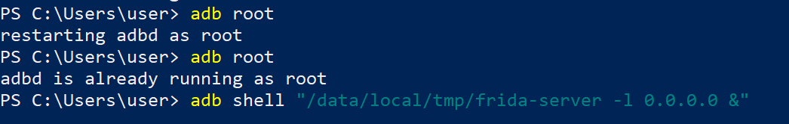
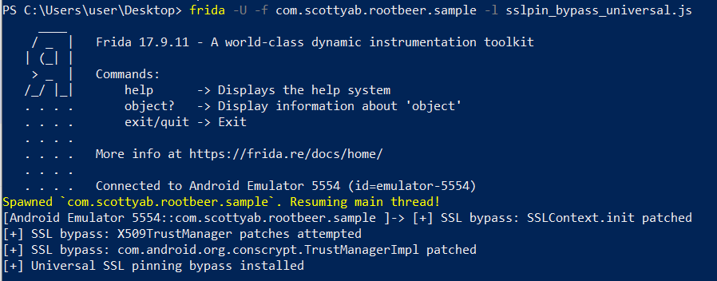
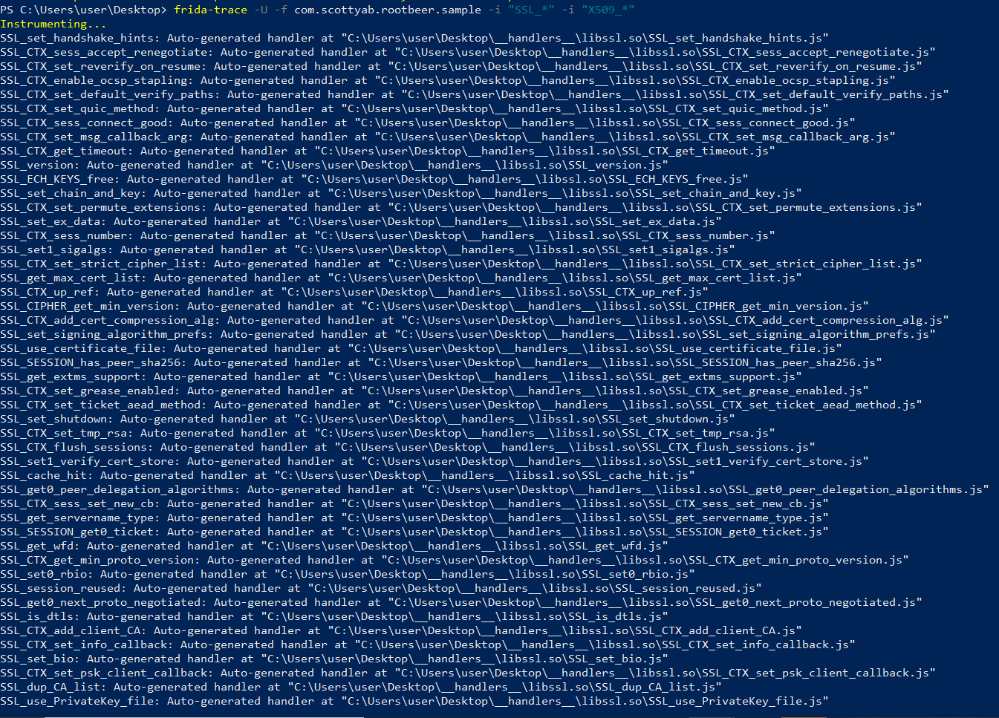
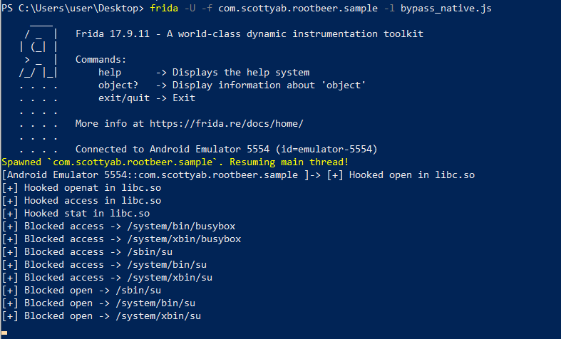
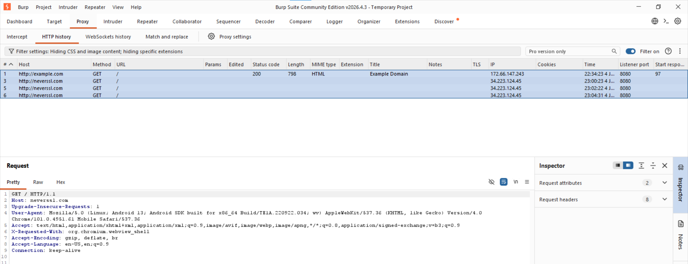

# 🔐 Lab Sécurité Mobile — Analyse Dynamique Android : Inspection TLS/HTTPS et Bypass SSL Pinning

**Auteur :** Hiba Sidinou
**Application cible :** `com.scottyab.rootbeer.sample` (RootBeer Sample)
**Environnement :** Émulateur Android 13 — x86_64 | Frida 17.9.11 | Objection 1.12.4
**OS hôte :** Windows 10 — PowerShell

> **Description :** Lab d'analyse dynamique mobile focalisé sur l'interception du trafic TLS/HTTPS et le contournement du SSL pinning via Frida. On instrumente les couches Java (TrustManager, OkHttp, Conscrypt) et native (BoringSSL/OpenSSL) pour rendre le trafic chiffré visible dans un proxy d'interception.

---

## Table des matières

1. [Preuves d'installation et de connexion](#1-preuves-dinstallation-et-de-connexion)
2. [Mise en place du proxy et du certificat CA](#2-mise-en-place-du-proxy-et-du-certificat-ca)
3. [Lancement de l'app sous Frida](#3-lancement-de-lapp-sous-frida)
4. [Bypass SSL Pinning Java — script universel](#4-bypass-ssl-pinning-java--script-universel)
5. [Bypass SSL Pinning natif — BoringSSL](#5-bypass-ssl-pinning-natif--boringssl)
6. [Validation dans le proxy](#6-validation-dans-le-proxy)

---

## 1. Preuves d'installation et de connexion

```powershell
frida --version    # 17.9.11
adb devices        # emulator-5554 device
frida-ps -Uai      # liste des apps visibles
```

| Outil | Version |
|-------|---------|
| Frida | 17.9.11 |
| Objection | 1.12.4 |
| ADB | emulator-5554 device |
| Python | 3.13 |


---

## 2. Mise en place du proxy et du certificat CA

### 2.1 Lancer Burp Suite sur le PC

- Onglet **Proxy → Proxy Settings → Bind to address : All interfaces → port 8080**
- Intercept ON

### 2.2 Rediriger le trafic via USB

```powershell
adb reverse tcp:8080 tcp:8080
adb shell settings put global http_proxy 127.0.0.1:8080
adb shell settings get global http_proxy
# affiche : 127.0.0.1:8080
```

### 2.3 Lancer le navigateur de l'émulateur vers le proxy

```powershell
adb shell am start -a android.intent.action.VIEW -d "http://neverssl.com"
```

> **Note Android 7+ :** Les apps ignorent les CA utilisateur si elles utilisent `Network Security Config` — d'où l'intérêt du bypass TrustManager via Frida.



---

## 3. Lancement de l'app sous Frida

### 3.1 Identifier le package cible

```powershell
frida-ps -Uai
```


Package cible retenu : `com.scottyab.rootbeer.sample`

### 3.2 Vérifier que frida-server tourne

```powershell
adb shell ps | findstr frida
# Si absent :
adb shell "/data/local/tmp/frida-server -l 0.0.0.0" &
```


### 3.3 ADB root et shell

```powershell
adb root
adb shell
```



---

## 4. Bypass SSL Pinning Java — script universel

### 4.1 Script `sslpin_bypass_universal.js`

Le script couvre 5 vecteurs d'attaque Java :

| # | Cible | Effet |
|---|-------|-------|
| 1 | `SSLContext.init` | Injecte un TrustManager permissif si absent |
| 2 | `X509TrustManager` (toutes implémentations) | Neutralise `checkServerTrusted` |
| 3 | `Conscrypt TrustManagerImpl` | Bypasse `checkTrusted` / `verifyChain` |
| 4 | `OkHttp3 CertificatePinner.check` | Saute la vérification de pin |
| 5 | `WebViewClient.onReceivedSslError` | Force `handler.proceed()` |

### 4.2 Exécution

```powershell
frida -U -f com.scottyab.rootbeer.sample -l sslpin_bypass_universal.js --no-pause
```



---

## 5. Bypass SSL Pinning natif — BoringSSL

### 5.1 Découverte des symboles natifs TLS

```powershell
frida-trace -U -f com.scottyab.rootbeer.sample -i "SSL_*" -i "X509_*"
```

Frida-trace instrumente tous les symboles SSL/X509 dans `libcrypto.so` et `libssl.so` :
- `SSL_get_verify_result`
- `X509_verify_cert`
- `X509_check_ip`



### 5.2 Script `sslpin_bypass_native.js`

```javascript
function hook(name, lib){
  const addr = Module.findExportByName(lib || null, name);
  if (!addr) return console.log('[*] no', name);
  Interceptor.attach(addr, {
    onLeave(rv){
      if (name === 'SSL_get_verify_result'){
        console.log('[+] SSL_get_verify_result -> X509_V_OK');
        rv.replace(ptr(0));
      }
    }
  });
  console.log('[+] Hooked', name);
}
hook('SSL_get_verify_result', 'libssl.so');
```

### 5.3 Bypass natif — résultat

```powershell
frida -U -f com.scottyab.rootbeer.sample -l bypass_native.js --no-pause
```



---

## 6. Validation dans le proxy

### 6.1 Requêtes HTTP interceptées dans Burp Suite

Burp Suite intercepte les requêtes HTTP de l'émulateur en clair :

```
GET / HTTP/1.1
Host: neverssl.com
User-Agent: Mozilla/5.0 (Linux; Android 13; Android SDK) AppleWebKit/537.36
```



### 6.2 Checklist de validation

| Vérification | Statut |
|-------------|--------|
| frida-server actif sur l'émulateur | ✅ |
| `adb reverse tcp:8080 tcp:8080` exécuté | ✅ |
| Proxy configuré sur l'émulateur | ✅ |
| Script `sslpin_bypass_universal.js` injecté | ✅ |
| Logs `[+] SSL bypass:` visibles dans Frida | ✅ |
| Requêtes HTTP visibles dans Burp | ✅ |
| Symboles SSL/X509 tracés via frida-trace | ✅ |
| Hooks natifs `libc.so` actifs | ✅ |

---

## Récapitulatif des livrables

| Livrable | Screenshot | Statut |
|----------|------------|--------|
| `frida --version` + `frida-ps -Uai` | `versions_python_pip_frida.png` + `frida_ps_Uai.png` | ✅ |
| frida-server pushé et lancé | `push_frida_server_chmod755.png` | ✅ |
| Objection installé | `objection_installation_upgrade.png` + `objection_version_objection_help.png` | ✅ |
| Script SSL bypass Java injecté | `ssl_bypass_frida_logs.png` | ✅ |
| frida-trace symboles SSL/X509 | `frida_trace_ssl_symbols.png` | ✅ |
| Bypass natif libc.so | `bypass_native_frida_result.png` | ✅ |
| Burp Suite — requêtes interceptées | `burp_https_intercepted.png` | ✅ |
| Burp Suite — proxy configuré | `burp_proxy_setup.png` | ✅ |

---

## Scripts utilisés

| Fichier | Rôle |
|---------|------|
| `sslpin_bypass_universal.js` | Bypass SSL pinning côté Java |
| `sslpin_bypass_native.js` | Bypass SSL pinning côté natif BoringSSL |
| `bypass_native.js` | Bypass root natif libc (lab précédent réutilisé) |

---

## Ressources

- [Frida — frida.re](https://frida.re)
- [Burp Suite — portswigger.net](https://portswigger.net/burp)
- [OWASP MASTG — MASVS-NETWORK-1](https://mas.owasp.org/MASVS/controls/MASVS-NETWORK-1/)
- [Android Network Security Config](https://developer.android.com/training/articles/security-config)
